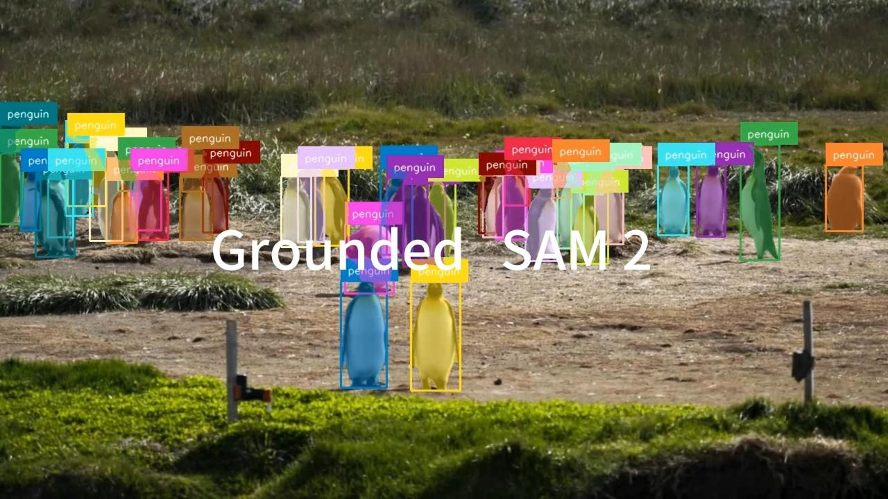
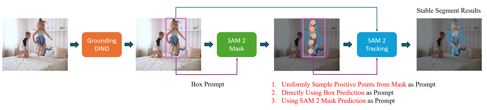
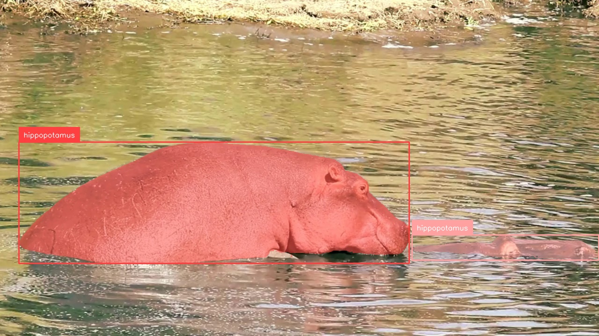
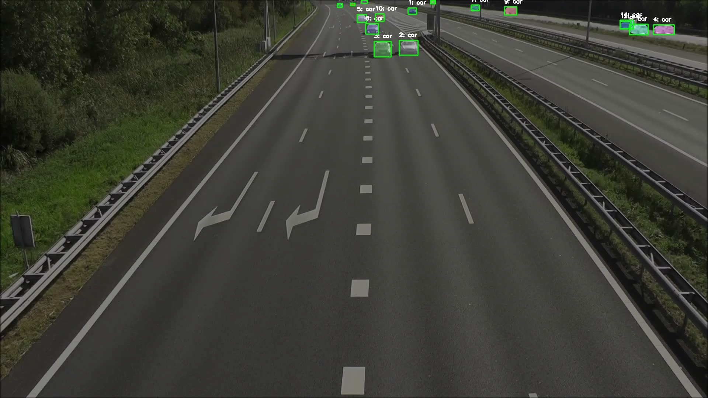

# Grounded SAM 2: Ground and Track Anything in Videos

**[IDEA-Research](https://github.com/idea-research)**

[Tianhe Ren](https://rentainhe.github.io/), [Shuo Shen](https://github.com/ShuoShenDe)

[[`SAM 2 Paper`](https://arxiv.org/abs/2408.00714)] [[`Grounding DINO Paper`](https://arxiv.org/abs/2303.05499)] [[`Grounding DINO 1.5 Paper`](https://arxiv.org/abs/2405.10300)] [[`DINO-X Paper`](https://arxiv.org/abs/2411.14347)] [[`BibTeX`](#citation)]

[](https://github.com/user-attachments/assets/f0fb0022-779a-49fb-8f46-3a18a8b4e893)

## Highlights

 Grounded SAM 2 is a foundation model pipeline towards grounding and track anything in Videos with [Grounding DINO](https://arxiv.org/abs/2303.05499), [Grounding DINO 1.5](https://arxiv.org/abs/2405.10300), [Florence-2](https://arxiv.org/abs/2311.06242), [DINO-X](https://arxiv.org/abs/2411.14347) and [SAM 2](https://arxiv.org/abs/2408.00714).

In this repo, we've supported the following demo with **simple implementations**:
- **Ground and Segment Anything** with Grounding DINO, Grounding DINO 1.5 & 1.6, DINO-X and SAM 2
- **Ground and Track Anything** with Grounding DINO, Grounding DINO 1.5 & 1.6, DINO-X and SAM 2
- **Detect, Segment and Track Visualization** based on the powerful [supervision](https://github.com/roboflow/supervision) library.

Grounded SAM 2 does not introduce significant methodological changes compared to [Grounded SAM: Assembling Open-World Models for Diverse Visual Tasks](https://arxiv.org/abs/2401.14159). Both approaches leverage the capabilities of open-world models to address complex visual tasks. Consequently, we try to **simplify the code implementation** in this repository, aiming to enhance user convenience.

## Latest updates
- **2025.04.20**: Update to `dds-cloudapi-sdk` API V2 version. The V1 version in the original API for `Grounding DINO 1.5` and `DINO-X` has been deprecated, please update to the latest `dds-cloudapi-sdk` by `pip install dds-cloudapi-sdk -U` to use `Grounding DINO 1.5 / 1.6` and `DINO-X` models. Please refer to [dds-cloudapi-sdk](https://github.com/deepdataspace/dds-cloudapi-sdk) and our [API docs](https://cloud.deepdataspace.com/docs) to view more details about the update.

- **2024.12.02**: Support **DINO-X with SAM 2** demos (including object segmentation and tracking), please install the latest version of `dds-cloudapi-sdk==0.3.3` and refer to [Grounded SAM 2 (with DINO-X)](#grounded-sam-2-image-demo-with-dino-x) and [Grounded SAM 2 Video (with DINO-X)](#grounded-sam-2-video-object-tracking-demo-with-custom-video-input-with-dino-x) for more details.

- **2024.10.24**: Support [SAHI (Slicing Aided Hyper Inference)](https://docs.ultralytics.com/guides/sahi-tiled-inference/) on Grounded SAM 2 (with Grounding DINO 1.5) which may be helpful for inferencing high resolution image with dense small objects (e.g. **4K** images).

- **2024.10.10**: Support `SAM-2.1` models, if you want to use `SAM 2.1` model, you need to update to the latest code and reinstall SAM 2 follow [SAM 2.1 Installation](https://github.com/facebookresearch/sam2?tab=readme-ov-file#latest-updates).

- **2024.08.31**: Support `dump json results` in Grounded SAM 2 Image Demos (with Grounding DINO).

- **2024.08.20**: Support **Florence-2 SAM 2 Image Demo** which includes `dense region caption`, `object detection`, `phrase grounding`, and cascaded auto-label pipeline `caption + phrase grounding`.

- **2024.08.09**: Support **Ground and Track New Object** throughout the whole videos. This feature is still under development now. Credits to [Shuo Shen](https://github.com/ShuoShenDe).

- **2024.08.07**: Support **Custom Video Inputs**, users need only submit their video file (e.g. `.mp4` file) with specific text prompts to get an impressive demo videos.

## Contents
- [Installation](#installation)
- [Grounded SAM 2 Demos](#grounded-sam-2-demos)
  - [Grounded SAM 2 Image Demo](#grounded-sam-2-image-demo-with-grounding-dino)
  - [Grounded SAM 2 Image Demo (with Grounding DINO 1.5 & 1.6)](#grounded-sam-2-image-demo-with-grounding-dino-15--16)
  - [Grounded SAM 2 Image Demo (with DINO-X)](#grounded-sam-2-image-demo-with-dino-x)
  - [Grounded SAM 2 with SAHI for High Resolution Image Inference](#sahi-slicing-aided-hyper-inference-with-grounding-dino-15-and-sam-2)
  - [Automatically Saving Grounding and Segmentation Results](#automatically-saving-grounding-results-image-demo)
  - [Grounded SAM 2 Video Object Tracking Demo](#grounded-sam-2-video-object-tracking-demo)
  - [Grounded SAM 2 Video Object Tracking Demo (with Grounding DINO 1.5 & 1.6)](#grounded-sam-2-video-object-tracking-demo-with-grounding-dino-15--16)
  - [Grounded SAM 2 Video Object Tracking with Custom Video Input (using Grounding DINO)](#grounded-sam-2-video-object-tracking-demo-with-custom-video-input-with-grounding-dino)
  - [Grounded SAM 2 Video Object Tracking with Custom Video Input (using Grounding DINO 1.5 & 1.6)](#grounded-sam-2-video-object-tracking-demo-with-custom-video-input-with-grounding-dino-15--16)
  - [Grounded SAM 2 Video Object Tracking Demo (with DINO-X)](#grounded-sam-2-video-object-tracking-demo-with-custom-video-input-with-dino-x)
  - [Grounded SAM 2 Video Object Tracking with Continues ID (using Grounding DINO)](#grounded-sam-2-video-object-tracking-with-continuous-id-with-grounding-dino)
- [Grounded SAM 2 Florence-2 Demos](#grounded-sam-2-florence-2-demos)
  - [Grounded SAM 2 Florence-2 Image Demo](#grounded-sam-2-florence-2-image-demo)
  - [Grounded SAM 2 Florence-2 Image Auto-Labeling Demo](#grounded-sam-2-florence-2-image-auto-labeling-demo)
- [Citation](#citation)


## Installation

Download the pretrained `SAM 2` checkpoints:

```bash
cd checkpoints
bash download_ckpts.sh
```

Download the pretrained `Grounding DINO` checkpoints:

```bash
cd gdino_checkpoints
bash download_ckpts.sh
```

### Installation without docker

Install PyTorch environment first. We use `python=3.10`, as well as `torch >= 2.3.1`, `torchvision>=0.18.1` and `cuda-12.1` in our environment to run this demo. Please follow the instructions [here](https://pytorch.org/get-started/locally/) to install both PyTorch and TorchVision dependencies. Installing both PyTorch and TorchVision with CUDA support is strongly recommended. You can easily install the latest version of PyTorch as follows:

```bash
pip3 install torch torchvision torchaudio
```

Since we need the CUDA compilation environment to compile the `Deformable Attention` operator used in Grounding DINO, we need to check whether the CUDA environment variables have been set correctly (which you can refer to [Grounding DINO Installation](https://github.com/IDEA-Research/GroundingDINO?tab=readme-ov-file#hammer_and_wrench-install) for more details). You can set the environment variable manually as follows if you want to build a local GPU environment for Grounding DINO to run Grounded SAM 2:

```bash
export CUDA_HOME=/path/to/cuda-12.1/
```

Install `Segment Anything 2`:

```bash
pip install -e .
```

Install `Grounding DINO`:

```bash
pip install --no-build-isolation -e grounding_dino
```

### Installation with docker
Build the Docker image and Run the Docker container:

```
cd Grounded-SAM-2
make build-image
make run
```
After executing these commands, you will be inside the Docker environment. The working directory within the container is set to: `/home/appuser/Grounded-SAM-2`

Once inside the Docker environment, you can start the demo by running:
```
python grounded_sam2_tracking_demo.py
```

## Grounded SAM 2 Demos
### Grounded SAM 2 Image Demo (with Grounding DINO)
Note that `Grounding DINO` has already been supported in [Huggingface](https://huggingface.co/IDEA-Research/grounding-dino-tiny), so we provide two choices for running `Grounded SAM 2` model:
- Use huggingface API to inference Grounding DINO (which is simple and clear)

```bash
python grounded_sam2_hf_model_demo.py
```

> [!NOTE]
> 🚨 If you encounter network issues while using the `HuggingFace` model, you can resolve them by setting the appropriate mirror source as `export HF_ENDPOINT=https://hf-mirror.com`

- Load local pretrained Grounding DINO checkpoint and inference with Grounding DINO original API (make sure you've already downloaded the pretrained checkpoint)

```bash
python grounded_sam2_local_demo.py
```


### Grounded SAM 2 Image Demo (with Grounding DINO 1.5 & 1.6)

We've already released our most capable open-set detection model [Grounding DINO 1.5 & 1.6](https://github.com/IDEA-Research/Grounding-DINO-1.5-API), which can be combined with SAM 2 for stronger open-set detection and segmentation capability. You can apply the API token first and run Grounded SAM 2 with Grounding DINO 1.5 as follows:

Install the latest DDS cloudapi:

```bash
pip install dds-cloudapi-sdk --upgrade
```

Apply your API token from our official website here: [request API token](https://deepdataspace.com/request_api).

```bash
python grounded_sam2_gd1.5_demo.py
```

### SAHI (Slicing Aided Hyper Inference) with Grounding DINO 1.5 and SAM 2

If your images are high resolution with dense objects, directly using Grounding DINO 1.5 for inference on the original image may not be the best choice. We support [SAHI (Slicing Aided Hyper Inference)](https://docs.ultralytics.com/guides/sahi-tiled-inference/), which works by first dividing the original image into smaller overlapping patches. Inference is then performed separately on each patch, and the final detection results are merged. This method is highly effective and accuracy for dense and small objects detection in high resolution images.

You can run SAHI inference by setting the following param in [grounded_sam2_gd1.5_demo.py](./grounded_sam2_gd1.5_demo.py):

```python
WITH_SLICE_INFERENCE = True
```

The visualization is shown as follows:

| Text Prompt | Input Image | Grounded SAM 2 | Grounded SAM 2 with SAHI |
|:----:|:----:|:----:|:----:|
| `Person` |  |  |  |

- **Notes:** We only support SAHI on Grounding DINO 1.5 because it works better with stronger grounding model which may produce less hallucination results.

### Grounded SAM 2 Image Demo (with DINO-X)

We've implemented Grounded SAM 2 with the strongest open-world perception model [DINO-X](https://github.com/IDEA-Research/DINO-X-API) for better open-set detection and segmentation performance. You can apply the API token first and run Grounded SAM 2 with DINO-X as follows:

Install the latest DDS cloudapi:

```bash
pip install dds-cloudapi-sdk --upgrade
```

Apply your API token from our official website here: [request API token](https://deepdataspace.com/request_api).

```bash
python grounded_sam2_dinox_demo.py
```

### Automatically Saving Grounding Results (Image Demo)

After setting `DUMP_JSON_RESULTS=True` in the following Grounded SAM 2 Image Demos:
- [grounded_sam2_local_demo.py](./grounded_sam2_local_demo.py)
- [grounded_sam2_hf_model_demo.py](./grounded_sam2_hf_model_demo.py)
- [grounded_sam2_gd1.5_demo.py](./grounded_sam2_gd1.5_demo.py)
- [grounded_sam2_dinox_demo.py](./grounded_sam2_dinox_demo.py)

The `grounding` and `segmentation` results will be automatically saved in the `outputs` dir with the following format:

```python
{
    "image_path": "path/to/image.jpg",
    "annotations": [
        {
            "class_name": "class_name",
            "bbox": [x1, y1, x2, y2],
            "segmentation": {
                "size": [h, w],
                "counts": "rle_encoded_mask"
            },
            "score": confidence score
        }
    ],
    "box_format": "xyxy",
    "img_width": w,
    "img_height": h
}
```


### Grounded SAM 2 Video Object Tracking Demo

Based on the strong tracking capability of SAM 2, we can combined it with Grounding DINO for open-set object segmentation and tracking. You can run the following scripts to get the tracking results with Grounded SAM 2:

```bash
python grounded_sam2_tracking_demo.py
```

- The tracking results of each frame will be saved in `./tracking_results`
- The video will be save as `children_tracking_demo_video.mp4`
- You can refine this file with different text prompt and video clips yourself to get more tracking results.
- We only prompt the first video frame with Grounding DINO here for simple usage.

#### Support Various Prompt Type for Tracking

We've supported different types of prompt for Grounded SAM 2 tracking demo:

- **Point Prompt**: In order to **get a stable segmentation results**, we re-use the SAM 2 image predictor to get the prediction mask from each object based on Grounding DINO box outputs, then we **uniformly sample points from the prediction mask** as point prompts for SAM 2 video predictor
- **Box Prompt**: We directly use the box outputs from Grounding DINO as box prompts for SAM 2 video predictor
- **Mask Prompt**: We use the SAM 2 mask prediction results based on Grounding DINO box outputs as mask prompt for SAM 2 video predictor.




### Grounded SAM 2 Video Object Tracking Demo (with Grounding DINO 1.5 & 1.6)

We've also support video object tracking demo based on our stronger `Grounding DINO 1.5` model and `SAM 2`, you can try the following demo after applying the API keys for running `Grounding DINO 1.5`:

```bash
python grounded_sam2_tracking_demo_with_gd1.5.py
```

### Grounded SAM 2 Video Object Tracking Demo with Custom Video Input (with Grounding DINO)

Users can upload their own video file (e.g. `assets/hippopotamus.mp4`) and specify their custom text prompts for grounding and tracking with Grounding DINO and SAM 2 by using the following scripts:

```bash
python grounded_sam2_tracking_demo_custom_video_input_gd1.0_hf_model.py
```

If you are not convenient to use huggingface demo, you can also run tracking demo with local grounding dino model with the following scripts:

```bash
python grounded_sam2_tracking_demo_custom_video_input_gd1.0_local_model.py
```

### Grounded SAM 2 Video Object Tracking Demo with Custom Video Input (with Grounding DINO 1.5 & 1.6)

Users can upload their own video file (e.g. `assets/hippopotamus.mp4`) and specify their custom text prompts for grounding and tracking with Grounding DINO 1.5 and SAM 2 by using the following scripts:

```bash
python grounded_sam2_tracking_demo_custom_video_input_gd1.5.py
```

You can specify the params in this file:

```python
VIDEO_PATH = "./assets/hippopotamus.mp4"
TEXT_PROMPT = "hippopotamus."
OUTPUT_VIDEO_PATH = "./hippopotamus_tracking_demo.mp4"
API_TOKEN_FOR_GD1_5 = "Your API token" # api token for G-DINO 1.5
PROMPT_TYPE_FOR_VIDEO = "mask" # using SAM 2 mask prediction as prompt for video predictor
```

After running our demo code, you can get the tracking results as follows:

[](https://github.com/user-attachments/assets/1fbdc6f4-3e50-4221-9600-98c397beecdf)

And we will automatically save the tracking visualization results in `OUTPUT_VIDEO_PATH`.

> [!WARNING]
> We initialize the box prompts on the first frame of the input video. If you want to start from different frame, you can refine `ann_frame_idx` by yourself in our code.

### Grounded SAM 2 Video Object Tracking Demo with Custom Video Input (with DINO-X)

Users can upload their own video file (e.g. `assets/hippopotamus.mp4`) and specify their custom text prompts for grounding and tracking with DINO-X and SAM 2 by using the following scripts:

```bash
python grounded_sam2_tracking_demo_custom_video_input_dinox.py
```

### Grounded-SAM-2 Video Object Tracking with Continuous ID (with Grounding DINO)

In above demos, we only prompt Grounded SAM 2 in specific frame, which may not be friendly to find new object during the whole video. In this demo, we try to **find new objects** and assign them with new ID across the whole video, this function is **still under develop**. it's not that stable now.

Users can upload their own video files and specify custom text prompts for grounding and tracking using the Grounding DINO and SAM 2 frameworks. To do this, execute the script:


```bash 
python grounded_sam2_tracking_demo_with_continuous_id.py
```

You can customize various parameters including:

- `text`: The grounding text prompt.
- `video_dir`: Directory containing the video files.
- `output_dir`: Directory to save the processed output.
- `output_video_path`: Path for the output video.
- `step`: Frame stepping for processing.
- `box_threshold`: box threshold for groundingdino model
- `text_threshold`: text threshold for groundingdino model
Note: This method supports only the mask type of text prompt.

After running our demo code, you can get the tracking results as follows:

[](https://github.com/user-attachments/assets/d3f91ad0-3d32-43c4-a0dc-0bed661415f4)

If you want to try `Grounding DINO 1.5` model, you can run the following scripts after setting your API token:

```bash
python grounded_sam2_tracking_demo_with_continuous_id_gd1.5.py
```

### Grounded-SAM-2 Video Object Tracking with Continuous ID plus Reverse Tracking(with Grounding DINO)
This method could simply cover the whole lifetime of the object
```bash
python grounded_sam2_tracking_demo_with_continuous_id_plus.py

```

### Grounded-SAM-2 Real-Time Object Tracking with Continuous ID (Live Video / Camera Stream)

This method enables **real-time object tracking** with **ID continuity** from a live camera or video stream. 

```bash
python grounded_sam2_tracking_camera_with_continuous_id.py
```


## Grounded SAM 2 Florence-2 Demos
### Grounded SAM 2 Florence-2 Image Demo

In this section, we will explore how to integrate the feature-rich and robust open-source models [Florence-2](https://arxiv.org/abs/2311.06242) and SAM 2 to develop practical applications.

[Florence-2](https://arxiv.org/abs/2311.06242) is a powerful vision foundation model by Microsoft which supports a series of vision tasks by prompting with special `task_prompt` includes but not limited to:

| Task | Task Prompt | Text Input | Task Introduction |
|:---:|:---:|:---:|:---:|
| Object Detection | `<OD>` | &#10008; | Detect main objects with single category name |
| Dense Region Caption | `<DENSE_REGION_CAPTION>` | &#10008; | Detect main objects with short description |
| Region Proposal | `<REGION_PROPOSAL>` | &#10008; | Generate proposals without category name |
| Phrase Grounding | `<CAPTION_TO_PHRASE_GROUNDING>` | &#10004; | Ground main objects in image mentioned in caption |
| Referring Expression Segmentation | `<REFERRING_EXPRESSION_SEGMENTATION>` | &#10004; | Ground the object which is most related to the text input |
| Open Vocabulary Detection and Segmentation | `<OPEN_VOCABULARY_DETECTION>` | &#10004; | Ground any object with text input |


Integrate `Florence-2` with `SAM-2`, we can build a strong vision pipeline to solve complex vision tasks, you can try the following scripts to run the demo:

> [!NOTE]
> 🚨 If you encounter network issues while using the `HuggingFace` model, you can resolve them by setting the appropriate mirror source as `export HF_ENDPOINT=https://hf-mirror.com`

**Object Detection and Segmentation**
```bash
python grounded_sam2_florence2_image_demo.py \
    --pipeline object_detection_segmentation \
    --image_path ./notebooks/images/cars.jpg
```

**Dense Region Caption and Segmentation**
```bash
python grounded_sam2_florence2_image_demo.py \
    --pipeline dense_region_caption_segmentation \
    --image_path ./notebooks/images/cars.jpg
```

**Region Proposal and Segmentation**
```bash
python grounded_sam2_florence2_image_demo.py \
    --pipeline region_proposal_segmentation \
    --image_path ./notebooks/images/cars.jpg
```

**Phrase Grounding and Segmentation**
```bash
python grounded_sam2_florence2_image_demo.py \
    --pipeline phrase_grounding_segmentation \
    --image_path ./notebooks/images/cars.jpg \
    --text_input "The image shows two vintage Chevrolet cars parked side by side, with one being a red convertible and the other a pink sedan, \
            set against the backdrop of an urban area with a multi-story building and trees. \
            The cars have Cuban license plates, indicating a location likely in Cuba."
```

**Referring Expression Segmentation**
```bash
python grounded_sam2_florence2_image_demo.py \
    --pipeline referring_expression_segmentation \
    --image_path ./notebooks/images/cars.jpg \
    --text_input "The left red car."
```

**Open-Vocabulary Detection and Segmentation**
```bash
python grounded_sam2_florence2_image_demo.py \
    --pipeline open_vocabulary_detection_segmentation \
    --image_path ./notebooks/images/cars.jpg \
    --text_input "car <and> building"
```
- Note that if you want to **detect multiple classes** you should split them with `<and>` in your input text.


### Grounded SAM 2 Florence-2 Image Auto-Labeling Demo
`Florence-2` can be used as a auto image annotator by cascading its caption capability with its grounding capability. 

| Task | Task Prompt | Text Input |
|:---:|:---:|:---:|
| Caption + Phrase Grounding | `<CAPTION>` + `<CAPTION_TO_PHRASE_GROUNDING>` | &#10008; |
| Detailed Caption + Phrase Grounding | `<DETAILED_CAPTION>` + `<CAPTION_TO_PHRASE_GROUNDING>` | &#10008; |
| More Detailed Caption + Phrase Grounding | `<MORE_DETAILED_CAPTION>` + `<CAPTION_TO_PHRASE_GROUNDING>` | &#10008; |

You can try the following scripts to run these demo:

**Caption to Phrase Grounding**
```bash
python grounded_sam2_florence2_autolabel_pipeline.py \
    --image_path ./notebooks/images/groceries.jpg \
    --pipeline caption_to_phrase_grounding \
    --caption_type caption
```

- You can specify `caption_type` to control the granularity of the caption, if you want a more detailed caption, you can try `--caption_type detailed_caption` or `--caption_type more_detailed_caption`.

### Citation

If you find this project helpful for your research, please consider citing the following BibTeX entry.

```BibTex
@misc{ravi2024sam2segmentimages,
      title={SAM 2: Segment Anything in Images and Videos}, 
      author={Nikhila Ravi and Valentin Gabeur and Yuan-Ting Hu and Ronghang Hu and Chaitanya Ryali and Tengyu Ma and Haitham Khedr and Roman Rädle and Chloe Rolland and Laura Gustafson and Eric Mintun and Junting Pan and Kalyan Vasudev Alwala and Nicolas Carion and Chao-Yuan Wu and Ross Girshick and Piotr Dollár and Christoph Feichtenhofer},
      year={2024},
      eprint={2408.00714},
      archivePrefix={arXiv},
      primaryClass={cs.CV},
      url={https://arxiv.org/abs/2408.00714}, 
}

@article{liu2023grounding,
  title={Grounding dino: Marrying dino with grounded pre-training for open-set object detection},
  author={Liu, Shilong and Zeng, Zhaoyang and Ren, Tianhe and Li, Feng and Zhang, Hao and Yang, Jie and Li, Chunyuan and Yang, Jianwei and Su, Hang and Zhu, Jun and others},
  journal={arXiv preprint arXiv:2303.05499},
  year={2023}
}

@misc{ren2024grounding,
      title={Grounding DINO 1.5: Advance the "Edge" of Open-Set Object Detection}, 
      author={Tianhe Ren and Qing Jiang and Shilong Liu and Zhaoyang Zeng and Wenlong Liu and Han Gao and Hongjie Huang and Zhengyu Ma and Xiaoke Jiang and Yihao Chen and Yuda Xiong and Hao Zhang and Feng Li and Peijun Tang and Kent Yu and Lei Zhang},
      year={2024},
      eprint={2405.10300},
      archivePrefix={arXiv},
      primaryClass={cs.CV}
}

@misc{ren2024grounded,
      title={Grounded SAM: Assembling Open-World Models for Diverse Visual Tasks}, 
      author={Tianhe Ren and Shilong Liu and Ailing Zeng and Jing Lin and Kunchang Li and He Cao and Jiayu Chen and Xinyu Huang and Yukang Chen and Feng Yan and Zhaoyang Zeng and Hao Zhang and Feng Li and Jie Yang and Hongyang Li and Qing Jiang and Lei Zhang},
      year={2024},
      eprint={2401.14159},
      archivePrefix={arXiv},
      primaryClass={cs.CV}
}

@article{kirillov2023segany,
  title={Segment Anything}, 
  author={Kirillov, Alexander and Mintun, Eric and Ravi, Nikhila and Mao, Hanzi and Rolland, Chloe and Gustafson, Laura and Xiao, Tete and Whitehead, Spencer and Berg, Alexander C. and Lo, Wan-Yen and Doll{\'a}r, Piotr and Girshick, Ross},
  journal={arXiv:2304.02643},
  year={2023}
}

@misc{jiang2024trex2,
      title={T-Rex2: Towards Generic Object Detection via Text-Visual Prompt Synergy}, 
      author={Qing Jiang and Feng Li and Zhaoyang Zeng and Tianhe Ren and Shilong Liu and Lei Zhang},
      year={2024},
      eprint={2403.14610},
      archivePrefix={arXiv},
      primaryClass={cs.CV}
}
```
