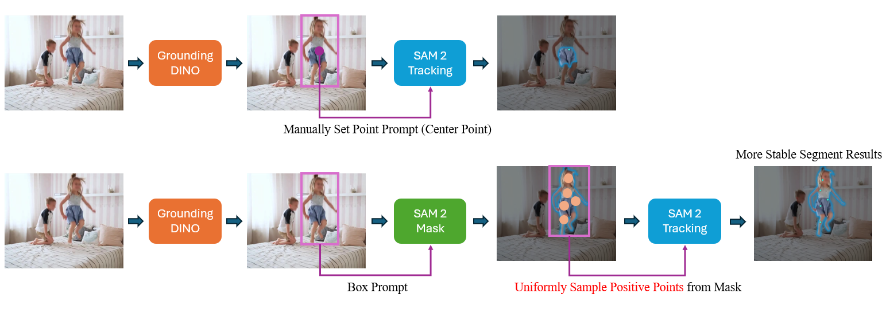

# Grounded-SAM-2
Grounded SAM 2: Ground and Track Anything with Grounding DINO, Grounding DINO 1.5 and SAM 2

Grounded SAM 2 does not introduce significant methodological changes compared to [Grounded SAM: Assembling Open-World Models for Diverse Visual Tasks](https://arxiv.org/abs/2401.14159). Both approaches leverage the capabilities of open-world models to address complex visual tasks. Consequently, we try to **simplify the code implementation** in this repository, aiming to enhance user convenience.

[](https://github.com/user-attachments/assets/d4335611-4e90-4090-97a1-7537d59a5dfc)

## Contents
- [Installation](#installation)
- [Grounded-SAM-2 Demo](#grounded-sam-2-demo)
  - [Grounded-SAM-2 Image Demo](#grounded-sam-2-image-demo-with-grounding-dino)
  - [Grounded-SAM-2 Image Demo (with Grounding DINO 1.5 & 1.6)](#grounded-sam-2-image-demo-with-grounding-dino-15--16)
  - [Grounded-SAM-2 Video Object Tracking Demo](#grounded-sam-2-video-object-tracking-demo)
  - [Grounded-SAM-2 Video Object Tracking Demo (with Grounding DINO 1.5 & 1.6)](#grounded-sam-2-video-object-tracking-demo-with-grounding-dino-15--16)
  - [Grounded-SAM-2 Video Object Tracking with Custom Video Input (using Grounding DINO 1.5 & 1.6)](#grounded-sam-2-video-object-tracking-demo-with-custom-video-input-with-grounding-dino-15--16)
- [Citation](#citation)


## Installation

Install PyTorch environment first. We use `python=3.10`, as well as `torch >= 2.3.1`, `torchvision>=0.18.1` and `cuda-12.1` in our environment to run this demo. Please follow the instructions [here](https://pytorch.org/get-started/locally/) to install both PyTorch and TorchVision dependencies. Installing both PyTorch and TorchVision with CUDA support is strongly recommended. You can easily install the latest version of PyTorch as follows:

```bash
pip3 install torch torchvision torchaudio
```

Since we need the CUDA compilation environment to compile the `Deformable Attention` operator used in Grounding DINO, we need to check whether the CUDA environment variables have been set correctly (which you can refer to [Grounding DINO Installation](https://github.com/IDEA-Research/GroundingDINO?tab=readme-ov-file#hammer_and_wrench-install) for more details). You can set the environment variable manually as follows if you want to build a local GPU environment for Grounding DINO to run Grounded SAM 2:

```bash
export CUDA_HOME=/path/to/cuda-12.1/
```

Install `Segment Anything 2`:

```bash
pip install -e .
```

Install `Grounding DINO`:

```bash
pip install --no-build-isolation -e grounding_dino
```

Download the pretrained `SAM 2` checkpoints:

```bash
cd checkpoints
bash download_ckpts.sh
```

Download the pretrained `Grounding DINO` checkpoints:

```bash
cd gdino_checkpoints
wget https://github.com/IDEA-Research/GroundingDINO/releases/download/v0.1.0-alpha/groundingdino_swint_ogc.pth
wget https://github.com/IDEA-Research/GroundingDINO/releases/download/v0.1.0-alpha2/groundingdino_swinb_cogcoor.pth
```

## Grounded-SAM-2 Demo
### Grounded-SAM-2 Image Demo (with Grounding DINO)
Note that `Grounding DINO` has already been supported in [Huggingface](https://huggingface.co/IDEA-Research/grounding-dino-tiny), so we provide two choices for running `Grounded-SAM-2` model:
- Use huggingface API to inference Grounding DINO (which is simple and clear)

```bash
python grounded_sam2_hf_model_demo.py
```

> [!NOTE]
> 🚨 If you encounter network issues while using the `HuggingFace` model, you can resolve them by setting the appropriate mirror source as `export HF_ENDPOINT=https://hf-mirror.com`

- Load local pretrained Grounding DINO checkpoint and inference with Grounding DINO original API (make sure you've already downloaded the pretrained checkpoint)

```bash
python grounded_sam2_local_demo.py
```


### Grounded-SAM-2 Image Demo (with Grounding DINO 1.5 & 1.6)

We've already released our most capable open-set detection model [Grounding DINO 1.5 & 1.6](https://github.com/IDEA-Research/Grounding-DINO-1.5-API), which can be combined with SAM 2 for stronger open-set detection and segmentation capability. You can apply the API token first and run Grounded-SAM-2 with Grounding DINO 1.5 as follows:

Install the latest DDS cloudapi:

```bash
pip install dds-cloudapi-sdk
```

Apply your API token from our official website here: [request API token](https://deepdataspace.com/request_api).

```bash
python grounded_sam2_gd1.5_demo.py
```

### Grounded-SAM-2 Video Object Tracking Demo

Based on the strong tracking capability of SAM 2, we can combined it with Grounding DINO for open-set object segmentation and tracking. You can run the following scripts to get the tracking results with Grounded-SAM-2:

```bash
python grounded_sam2_tracking_demo.py
```

- The tracking results of each frame will be saved in `./tracking_results`
- The video will be save as `children_tracking_demo_video.mp4`
- You can refine this file with different text prompt and video clips yourself to get more tracking results.
- We only prompt the first video frame with Grounding DINO here for simple usage.

#### Uniform Point Sampling for Stable Segmentation Results in Video Demos based on SAM 2 Image Predictor

We have observed that the video predictor in SAM 2 currently **did not support box prompts** (please feel free to point out any updates or functionalities we may have overlooked during development). However, Grounding DINO provides box prompts, which need to be converted into point prompts for use in video tracking. A straightforward approach is to directly sample the center point of the box as a point prompt. Nevertheless, this method may encounter certain issues in practical testing scenarios. To **get a more stable segmentation results**, we reuse the SAM 2 image predictor to get the prediction mask for each object first, then we **uniformly sample points from the prediction mask** to prompt SAM 2 video predictor.

A simple pipeline visualization is as follows:



> [!NOTE]
> We noticed that the SAM 2 video predictor also supports mask prompts. Using the SAM 2 mask prediction results should be a more straightforward approach, and we will explore this implementation in future release.

### Grounded-SAM-2 Video Object Tracking Demo (with Grounding DINO 1.5 & 1.6)

We've also support video object tracking demo based on our stronger `Grounding DINO 1.5` model and `SAM 2`, you can try the following demo after applying the API keys for running `Grounding DINO 1.5`:

```bash
python grounded_sam2_tracking_demo_with_gd1.5.py
```

### Grounded-SAM-2 Video Object Tracking Demo with Custom Video Input (with Grounding DINO 1.5 & 1.6)

Users can upload their own video file (e.g. `assets/hippopotamus.mp4`) and specify their custom text prompts for grounding and tracking with the following scripts:

```bash
python grounded_sam2_tracking_demo_with_video_input_gd1.5.py
```

You can specify the params in this file:

```python
VIDEO_PATH = "./assets/hippopotamus.mp4"
TEXT_PROMPT = "hippopotamus."
OUTPUT_VIDEO_PATH = "./hippopotamus_tracking_demo.mp4"
```

After running our demo code, you can get the tracking results as follows:

[](https://github.com/user-attachments/assets/1fbdc6f4-3e50-4221-9600-98c397beecdf)

And we will automatically save the tracking visualization results in `OUTPUT_VIDEO_PATH`.

> [!WARNING]
> We initilize the box prompts on the first frame of the input video. If you want to start from different frame, you can refine `ann_frame_idx` by yourself in our code.

### Citation

If you find this project helpful for your research, please consider citing the following BibTeX entry.

```BibTex
@misc{ravi2024sam2segmentimages,
      title={SAM 2: Segment Anything in Images and Videos}, 
      author={Nikhila Ravi and Valentin Gabeur and Yuan-Ting Hu and Ronghang Hu and Chaitanya Ryali and Tengyu Ma and Haitham Khedr and Roman Rädle and Chloe Rolland and Laura Gustafson and Eric Mintun and Junting Pan and Kalyan Vasudev Alwala and Nicolas Carion and Chao-Yuan Wu and Ross Girshick and Piotr Dollár and Christoph Feichtenhofer},
      year={2024},
      eprint={2408.00714},
      archivePrefix={arXiv},
      primaryClass={cs.CV},
      url={https://arxiv.org/abs/2408.00714}, 
}

@article{kirillov2023segany,
  title={Segment Anything}, 
  author={Kirillov, Alexander and Mintun, Eric and Ravi, Nikhila and Mao, Hanzi and Rolland, Chloe and Gustafson, Laura and Xiao, Tete and Whitehead, Spencer and Berg, Alexander C. and Lo, Wan-Yen and Doll{\'a}r, Piotr and Girshick, Ross},
  journal={arXiv:2304.02643},
  year={2023}
}

@article{liu2023grounding,
  title={Grounding dino: Marrying dino with grounded pre-training for open-set object detection},
  author={Liu, Shilong and Zeng, Zhaoyang and Ren, Tianhe and Li, Feng and Zhang, Hao and Yang, Jie and Li, Chunyuan and Yang, Jianwei and Su, Hang and Zhu, Jun and others},
  journal={arXiv preprint arXiv:2303.05499},
  year={2023}
}

@misc{ren2024grounded,
      title={Grounded SAM: Assembling Open-World Models for Diverse Visual Tasks}, 
      author={Tianhe Ren and Shilong Liu and Ailing Zeng and Jing Lin and Kunchang Li and He Cao and Jiayu Chen and Xinyu Huang and Yukang Chen and Feng Yan and Zhaoyang Zeng and Hao Zhang and Feng Li and Jie Yang and Hongyang Li and Qing Jiang and Lei Zhang},
      year={2024},
      eprint={2401.14159},
      archivePrefix={arXiv},
      primaryClass={cs.CV}
}

@misc{jiang2024trex2,
      title={T-Rex2: Towards Generic Object Detection via Text-Visual Prompt Synergy}, 
      author={Qing Jiang and Feng Li and Zhaoyang Zeng and Tianhe Ren and Shilong Liu and Lei Zhang},
      year={2024},
      eprint={2403.14610},
      archivePrefix={arXiv},
      primaryClass={cs.CV}
}
```